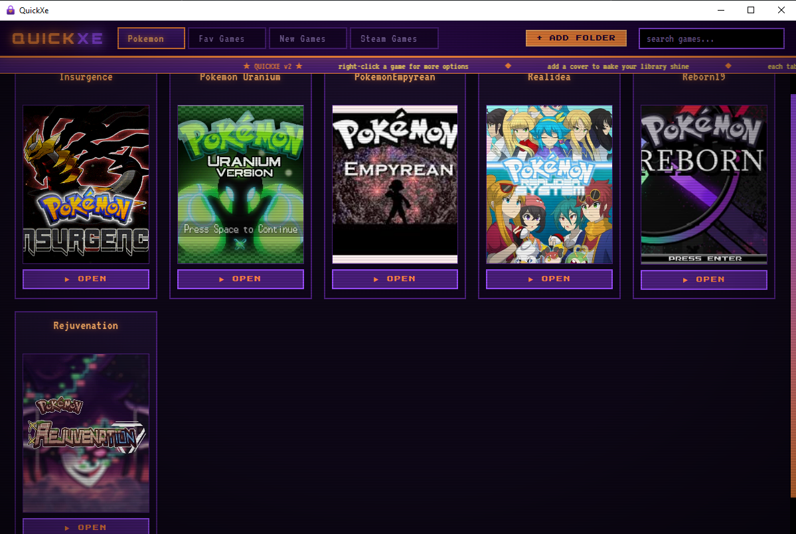

# QuickXe  

A retro-styled game launcher for fan games and the like.

## Install

1. Install Python 3.10+ from [python.org](https://www.python.org/downloads/).
   **Check "Add Python to PATH"** during install. Python 3.10 - 3.14 all work.
2. Unzip this folder somewhere you'll keep it (e.g. `C:\Tools\QuickXe`).
3. Double-click **`install.bat`**.

The installer pulls down dependencies (`PySide6`, `pillow`, `pyinstaller`),
builds `dist\QuickXe.exe`, and drops a desktop shortcut. The first install
takes a few minutes because PySide6 includes the Qt framework (~250MB
download, ~150MB final exe).

## Uninstall

Double-click **`uninstall.bat`**. It removes the shortcut, the built exe,
and saved settings/covers in `%APPDATA%\QuickXe`. **Your game files are
never touched.** Source files in this folder are kept so you can reinstall;
delete the folder afterward to wipe everything.

## Features

- **Library tabs** along the top - add as many folders as you want
  (GOG / RPG Maker / itch / etc.). Click to switch, double-click
  to rename, hover and click the `×` to remove.
- **Auto-cleaned names** - `Stardew_Valley_v1.6.9-GOG` becomes
  `Stardew Valley`. Scene tags, version numbers, repack labels stripped.
  In-title numbers like `Cyberpunk 2077` and `Persona 5` are kept.
- **4:5 covers** - every tile identical size. Click the placeholder
  or right-click → Set cover to assign any image; auto-cropped center.
  Covers are stored in `%APPDATA%\QuickXe\covers\` - your game folders
  are never modified.
- **Right-click any game** for: Launch / Set cover / Remove cover /
  Open folder in Explorer / **Delete folder from disk**.
- The "delete folder" option requires typing `DELETE` to confirm and is
  blocked from touching anything outside a library folder.

## How scanning works

For each library folder, QuickXe looks at every direct subfolder:
- folder name → game name (after cleanup)
- finds the most game-looking `.exe` inside (prefers ones matching the
  folder name, skips `unins*.exe`, `setup.exe`, `vcredist*.exe`, etc.)
- a loose `.exe` directly in the library root counts as its own game

The active library and cover assignments are saved to
`%APPDATA%\QuickXe\config.json`.

## Tech notes

- UI is HTML/CSS/JS rendered inside a `QWebEngineView` (Qt's Chromium-based
  webview). Python ↔ JS communication uses `QWebChannel`.
- This avoids the `pywebview` + `pythonnet` build issues on Python 3.13+.
- Tested on Python 3.10 through 3.14.

## Files in this folder

| File | What it does |
|---|---|
| `install.bat` | One-click installer |
| `uninstall.bat` | Removes shortcut, exe, and app data |
| `quickxe.py` | Python backend (scanning, launching, IO) |
| `index.html` | The UI |
| `quickxe.ico` / `quickxe.png` | Heart-lock icon |
| `make_icon.py` | Re-generate the icon if you want to tweak it |
| `create_shortcut.vbs` | Used by install.bat |
